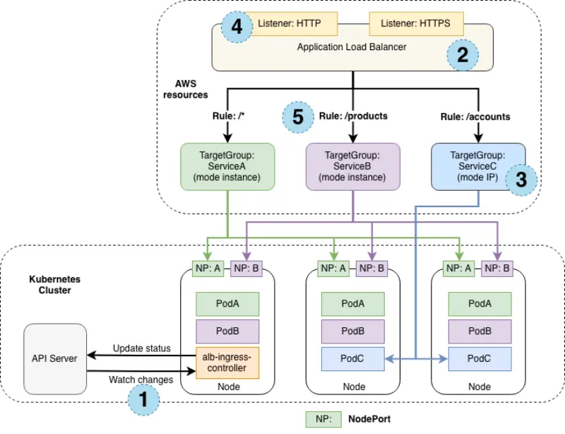

# AWS Load Balancer Controller 
- is a controller to help manage Elastic Load Balancers for a Kubernetes cluster.
- The controller can provision the following resources:
    * An AWS Application Load Balancer (Works at layer 7) when you create a Kubernetes Ingress.
    * An AWS Network Load Balancer (works at layer 4) when you create a Kubernetes Service of type LoadBalancer.
    * Example Decision Scenarios
        * Public web app with multiple microservices under one domain?
→ Use ALB + Ingress.
        * Internal gRPC service or custom TCP service?
→ Use NLB + Service of type LoadBalancer.
        * Need static IP for firewall rules?
→ Use NLB.
        * Need SSL offload + WAF + path-based routing?
→ Use ALB.Creates an IAM role required by the AWS Load Balancer Controller
- We need  an IAM role required by the AWS Load Balancer Controller
---
- To install the AWS Load Balancer controller using helm
    ```
        helm repo add eks-charts https://aws.github.io/eks-charts
        helm upgrade --install aws-load-balancer-controller eks-charts/aws-load-balancer-controller \
        --version "${LBC_CHART_VERSION}" \
        --namespace "kube-system" \
        --set "clusterName=${EKS_CLUSTER_NAME}" \
        --set "serviceAccount.name=aws-load-balancer-controller-sa" \
        --set "serviceAccount.annotations.eks\\.amazonaws\\.com/role-arn"="$LBC_ROLE_ARN" \
        --wait
    ```
- NLB


## Understanding Target Group Modes: Instance vs IP

The diagram above illustrates how application traffic flows differently depending on whether the **target group mode** is set to **Instance** or **IP**.

---

### 📦 **Instance Mode**

- Traffic flows via a **NodePort** created for a Kubernetes Service on each EC2 node.
- In this mode, **kube-proxy** is responsible for routing the traffic to the actual service pod.
- The service pod can reside on **a different node** than the one that initially received the traffic from the load balancer.
- **ServiceA (green)** and **ServiceB (pink)** are examples configured in **Instance mode**.

---

### 🌐 **IP Mode**

- Traffic flows **directly** to the **service pods** from the load balancer, skipping the kube-proxy layer.
- This results in a more direct and efficient routing path.
- **ServiceC (blue)** is an example configured in **IP mode**.

---

### 🔢 Numbered Elements in the Diagram

1. **EKS Cluster** where the services are deployed  
2. **ELB (Elastic Load Balancer)** instance exposing the service  
3. **Target Group Mode Configuration**: Instance or IP  
4. **Listener Protocols** configured on the load balancer (e.g., HTTP, HTTPS, TCP)  
5. **Target Group Rules** to determine routing to the correct service destination  

---

### ✅ Benefits of Using IP Target Mode with NLB

- More **efficient network path** for inbound traffic, bypassing `kube-proxy`  
- Eliminates the need to manage `externalTrafficPolicy` and its trade-offs  
- Required when the application is deployed using **AWS Fargate** instead of EC2  

### Ingress and ALB and ALB Controller
- In Kubernetes, Ingress is a resource that defines HTTP/S routing rules to your services.
- In AWS, ALB is the actual L7 (HTTP/S) load balancer that sits in front of your cluster.
- The AWS Load Balancer Controller is the glue — it reads your Ingress and creates/configures an ALB for you.

